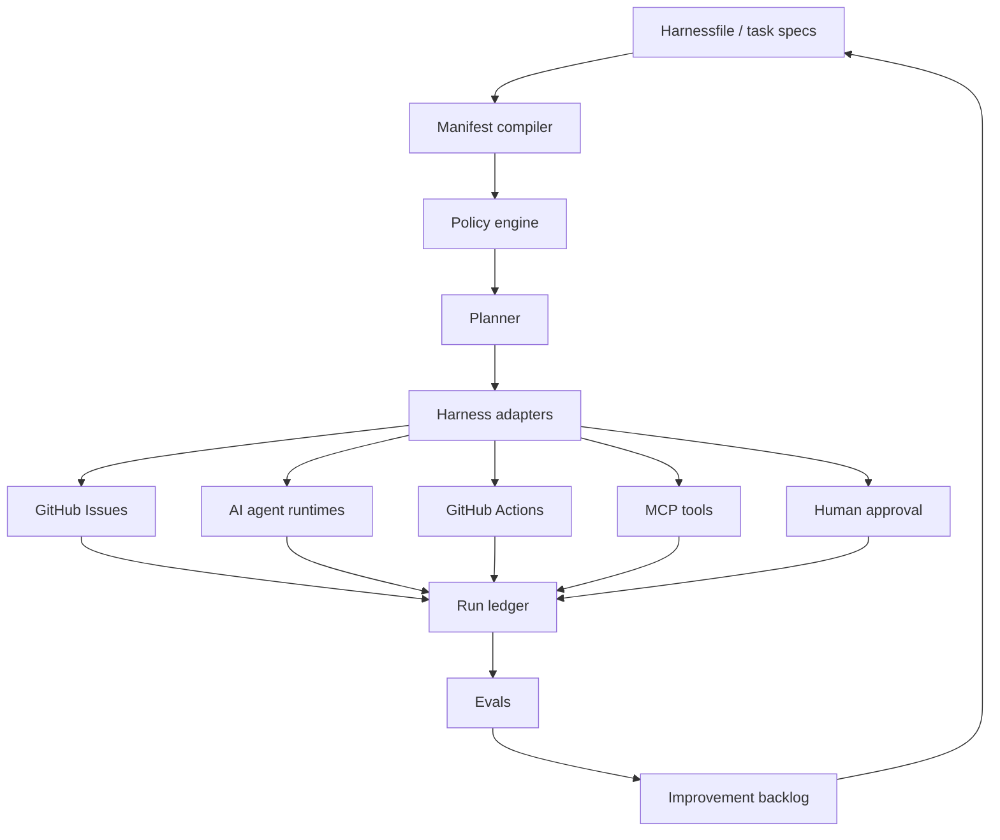

# Architecture

## System Shape

Delegation Bot should become a layered control plane:



## Core Concepts

### Harnessfile

A versioned manifest that describes delegated work before execution:

- objective
- triggers
- agents
- models
- capability packs
- executors
- tools and context
- policies
- outputs
- evals

The current `tasks/*.md` format can remain as a simple issue-generation layer.
The Harnessfile becomes the larger orchestration format.

See `docs/agent-enablement.md` for the agent passport and autonomy ladder model.

### Manifest Compiler

Transforms declarative plans into concrete execution plans. It should be pure
and deterministic: same manifest, same compiled plan.

Early responsibilities:

- validate required fields
- normalize owners, executors, outputs, and evals
- produce a dry-run plan
- explain what would happen before anything writes to GitHub

The current implementation starts this layer with `scripts/delegation.py plan`,
which compiles a Harnessfile into a dry-run action plan and can emit a JSONL run
ledger without executing live writes.

### Policy Engine

Applies constraints before work is executed.

Policy examples:

- which tools can be called
- which operations require human approval
- maximum cost or runtime
- allowed repositories and branches
- whether secrets or external network are allowed
- required evidence before completion

Policy should enable bigger work by making boundaries explicit. The ideal flow
is not "deny agents"; it is "show what power this agent has and what proof it
needs for the next level."

### Harness Adapters

Adapters let the project route work to many execution backends without making
the manifest depend on any one framework.

Before live execution, each adapter should expose a contract: inputs, outputs,
risk, approval requirements, planned event types, and required evidence. The
current implementation starts this with `scripts/adapters.py`,
`schemas/adapter-contract.v1.schema.json`, and `python scripts/delegation.py
adapters`.

Initial adapter targets:

- `github.issue`: create and update Issues
- `github.actions`: run a workflow and collect status
- `codex.thread`: hand off implementation work
- `openai.agents`: run an agent workflow
- `anthropic.messages`: plan a Claude model call through the Messages API
- `claude.code`: hand off coding work to Claude Code
- `langgraph.graph`: invoke a long-running graph
- `openclaw.gateway`: route work to a local personal assistant runtime
- `hermes.agent`: route work to a skill-learning agent runtime
- `mcp.tool`: expose or call an MCP tool
- `human.approval`: pause until a person approves

Adapters should emit structured events into the run ledger.

See `docs/adapter-contracts.md` for the adapter contract model.

### Run Ledger

An append-only record of what happened.

Minimum event shape:

```json
{
  "run_id": "run_2026_07_03_001",
  "timestamp": "2026-07-03T20:30:00Z",
  "type": "adapter.github.issue.created",
  "actor": "delegation-bot",
  "target": "AmmarAlBalkhi/delegation-bot#123",
  "evidence": {
    "url": "https://github.com/AmmarAlBalkhi/delegation-bot/issues/123"
  }
}
```

This can map to OpenTelemetry spans, structured logs, or other trace exporters.
The important design choice is that each action produces inspectable evidence.
See `docs/opentelemetry-mapping.md` for the first mapping notes.

The first ledger schema is documented in `schemas/ledger.v1.schema.json`.
Dry-run ledgers are intentionally marked as `planned` so they can be inspected
without implying execution.

When an executor action has an adapter contract, the dry-run ledger includes the
contract's planned event types. This gives evals an adapter-aware trail even
before live execution exists.

Promotion reports are documented in `schemas/promotion-report.v1.schema.json`.
They are derived from Harnessfile promotion rules plus ledger eval evidence.
Eval reports are documented in `schemas/eval-report.v1.schema.json`.

### Evals

Evals are pass/fail checks for delegated work.

Examples:

- all required issues created
- no duplicate issue markers
- tests pass before PR creation
- every risky tool call had approval
- child tasks have backlinks to parents
- final answer contains required evidence links

Evals should run locally, in CI, and after live harness runs.

Promotion uses evals as evidence. A planned eval is not enough; a promotion
requires passed eval events in the ledger.

The first eval runner is `scripts/delegation.py eval`. It reads the ledger and
can append `eval.result` events back into the ledger.

Failed or blocked evals should become focused improvement issues only after
dedupe and policy checks. See `docs/eval-to-issue-feedback.md` for the staged
design.

## Data Flow

1. Load manifests from `tasks/`, `harnesses/`, or an explicit file path.
2. Validate structure and policy declarations.
3. Compile a run plan.
4. Execute in dry-run or apply mode.
5. Write run ledger events.
6. Run evals against outputs and ledger.
7. Create follow-up issues for failures or improvement opportunities.

## Repository Layout

Proposed direction:

```text
delegation_bot/
  adapters.py
  cli.py
  eval_feedback.py
  evals.py
  harness_manifest.py
  harness_plan.py
  playbook_catalog.py
  promotion.py
docs/
  vision.md
  architecture.md
  agent-enablement.md
  opentelemetry-mapping.md
playbooks/
  catalog.yaml
  code-review.yaml
  ci-repair.yaml
  documentation-refresh.yaml
examples/
  ai-harness-control-plane.yaml
schemas/
  adapter-contract.v1.schema.json
  eval-report.v1.schema.json
  harness.v1.schema.json
  ledger.v1.schema.json
  playbook-catalog.v1.schema.json
  promotion-report.v1.schema.json
scripts/
  delegation.py
  delegation_bot.py
  qa.py
tests/
  test_adapters.py
  test_delegation_bot.py
  test_delegation_cli.py
  test_evals.py
  test_harness_manifest.py
```

`delegation_bot/` is the installable package. `scripts/delegation.py` remains a
compatibility wrapper for the package CLI, and `scripts/delegation_bot.py`
remains the legacy GitHub Issue bot entry point.

## Build Order

1. Keep the current GitHub Issue bot stable.
2. Add Harnessfile validation and dry-run summaries.
3. Compile Harnessfiles into dry-run execution plans.
4. Add a run ledger file output.
5. Add agent passports and capability packs.
6. Add promotion reports from ledger eval evidence.
7. Add built-in eval result generation.
8. Add policy gates.
9. Add adapter contract registry.
10. Add adapter interfaces.
11. Add no-network sample adapter for contributors.
12. Add the first real non-GitHub dry-run adapter.
13. Add eval-to-issue feedback loops.
